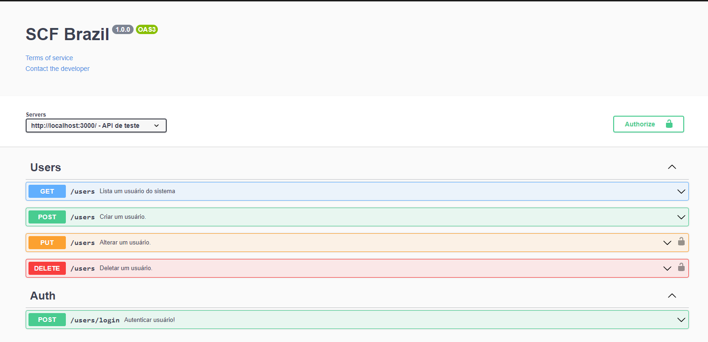

<h1 align="center">
    <p>API de Usuários SCF Brazil</p>
</h1>

<h4 align="center"> 
	Concluído 🚀 🚧
</h4>

<p align="center">
 <a href="#-sobre-o-projeto">Sobre</a> •
 <a href="#-funcionalidades">Funcionalidades</a> •
 <a href="#-testar-api-online">Testar API</a> • 
 <a href="#-como-executar-o-projeto">Como executar</a> • 
 <a href="#-tecnologias">Tecnologias</a> 
</p>

## 💻 Sobre o projeto

O projeto trata-se de uma APIRest para usuários.

---

## ⚙️ Funcionalidades

- [x] O Usuário comum pode:
  - [x] Pesquisar outros usuários.
  - [x] Criar seu próprio usuário.
- [x] O Admistrador pode:
  - [x] Editar um usuário.
  - [x] Deletar um usuário.

---

## 🚀 Como executar o projeto

### Pré-requisitos

Antes de começar, você vai precisar ter instalado em sua máquina as seguintes ferramentas:
[Git](https://git-scm.com), [Node.js](https://nodejs.org/en/).
Além disto é bom ter um editor para trabalhar com o código como [VSCode](https://code.visualstudio.com)

### Testar API Online

Para documentação e facilitar a utilização dos teste da API foi utilizado o [Swagger](https://swagger.io/), o qual a página esta disponibilizado na rota [**/api-docs**](http://localhost:3000/api-docs/#/).

<h1 align="center">
    
</h1>

#### 🎲 Rodando o Projeto

```bash
# Clone este repositório
$ git clone https://github.com/RenatoAlbuquerque/scfbrazil
# Acesse a pasta do projeto no terminal/cmd
$ cd scfbrazil
# Vá para a pasta src
$ cd src
# Instale as dependências
$ npm install
# Execute a aplicação em modo de desenvolvimento
$ npm start
# O servidor inciará na porta:3000 - acesse http://localhost:3000
```

---

## 🛠 Tecnologias

As seguintes ferramentas foram usadas na construção do projeto:

- **[Express](https://expressjs.com/)**
- **[CORS](https://expressjs.com/en/resources/middleware/cors.html)**
- **[JsonWebToken](https://www.npmjs.com/package/jsonwebtoken)**
- **[Swagger](https://swagger.io/)**
- **[Yup](https://www.npmjs.com/package/yup)**

> Veja o arquivo [package.json](https://github.com/RenatoAlbuquerque/scfbrazil/blob/main/package.json)

---
